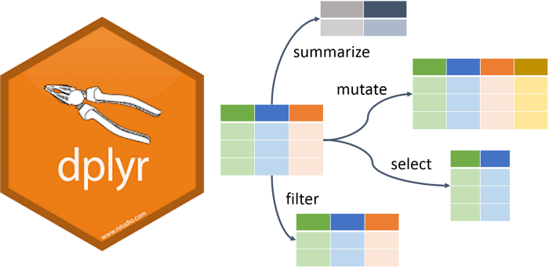

```{r setup, include=FALSE}
library(learnr)
library(tidyverse)
knitr::opts_chunk$set(echo = FALSE)
```

##  What is **tidyverse**?

### R packages for data science 
*tidyverse* is an opinionated collection of R packages designed for data science. 
All packages share an underlying design philosophy, grammar, and data structures.
<br/>
<br/>
```{r fig1, echo = FALSE, out.width = "100%"}
knitr::include_graphics("images/tidyverse-packages.png")
```

<br/>

### Instalation and use
Install the complete tidyverse with:
```{r install_tidyverse, echo = TRUE, eval = FALSE}
install.packages("tidyverse")
```
Usage:  
```{r run_tidyverse, echo = TRUE, eval = FALSE}
library(tidyverse)
```
loads the core tidyverse packages:

* [**ggplot2**](https://ggplot2.tidyverse.org/), for data visualisation.  
* [**dplyr**](https://dplyr.tidyverse.org/), for data manipulation.  
* [**tidyr**](https://tidyr.tidyverse.org/), for data tidying.  
* [*readr*](https://readr.tidyverse.org/), for data import.  
* [purrr](https://purrr.tidyverse.org/), for functional programming.  
* [*tibble*](https://tibble.tidyverse.org/), for tibbles, a modern re-imagining of data frames.  
* [**stringr**](https://github.com/tidyverse/stringr), for strings.  
* [forcats](https://github.com/hadley/forcats), for factors.  

### Main author
```{r fig2, echo = FALSE, out.width = "30%"}

```

```{r who_is_this, echo = FALSE}
question("Who is on the photo?",
         answer("Matt Dowle", message = "OMG you don't know how THE Matt Dowle looks!"),
         answer("some random hippster"),
         answer("Vedran Franke"),
         answer("Hadley Wickham", correct = TRUE), 
         answer("I don't care"), 
         allow_retry = TRUE, 
         random_answer_order = TRUE
)
```


## **dplyr overview**
### Overview
*dplyr* is a grammar of data manipulation, providing a consistent set of **verbs** that help you solve the most common data manipulation challenges:

* `filter()` picks cases based on their values
* `arrange()` changes the ordering of the rows
* `select()` picks variables based on their names
* `mutate()` adds new variables that are functions of existing variables
* `summarise()` reduces multiple values down to a single summary value
<br/>
<br/>
<br/>
```{r fig3, echo = FALSE, out.width = "100%"}

```

## **dplyr::filter()**
#### Load libraries:
```{r, echo = TRUE, message = F, warning = F}
library(dplyr)
library(tibble)
library(nycflights13)
library(ggplot2)
library(data.table)
library(magrittr)
```

<br/>

#### Get all flights on 1st of January:
__*dplyr*__ way:
```{r, echo = T, rows.print = 7}
filter(flights, month == 1, day == 1)
```

Base equivalent:
```{r, echo = T, eval = F}
flights[flights$month == 1 & flights$day == 1, ]
```

*data.table* equivalent:
```{r, echo = T, eval = F}
flights.dt <- data.table(flights)
flights.dt[month == 1 & day == 1, ]
```

<br/>

#### Exercises
Get all flights in September which traveled for more than 4000 miles
```{r dplyr_filter_1, exercise = TRUE, rows.print = 7}

```
```{r dplyr_filter_1-solution}
filter(flights, month == 9, distance > 4000)
```

Get all flights which were delayed for more than half an hour in total
```{r dplyr_filter_2, exercise = TRUE, rows.print = 7}

```
```{r dplyr_filter_2-solution}
filter(flights, (dep_delay + arr_delay) > 30)
```

Get the flight(s) with longest flight time
```{r dplyr_filter_3, exercise = TRUE, rows.print = 7}

```
```{r dplyr_filter_3-hint-1}
# use max()
```
```{r dplyr_filter_3-hint-2}
# take NA values in account
```
```{r dplyr_filter_3-solution}
filter(flights, air_time == max(air_time, na.rm = T))
```


## **dplyr::arrange()**
#### Arrange rows by year, month and day:
__*dplyr*__ way:
```{r, echo = T, rows.print = 7}
arrange(flights, year, month, day)
```

Base equivalent:
```{r, echo = T, eval = F}
flights[order(flights$year, flights$month, flights$day), ]
```

*data.table* equivalent:
```{r, echo = T, eval = F}
flights.dt[order(year, month, day), ]
```

<br/>

#### Arrange rows by arrival delay in descending order: 
__*dplyr*__ way:
```{r, echo = T, rows.print = 7}
arrange(flights, desc(arr_delay))
```

__*dplyr*__ way alternative:
```{r, echo = T, eval = F}
arrange(flights, -arr_delay)
```

Base equivalent:
```{r, echo = T, eval = F}
flights[order(flights$arr_delay, decreasing = T), ]
```

*data.table* equivalent:
```{r, echo = T, eval = F}
flights.dt[order(arr_delay, decreasing = T), ]
```

<br/>

#### Exercises
Arrange by tail number in alphabetical order:
```{r dplyr_arrange_1, exercise = TRUE, rows.print = 7}

```
```{r dplyr_arrange_1-solution}
arrange(flights, tailnum)
```

Arrange by average speed, fastest to slowest:
```{r dplyr_arrange_2, exercise = TRUE, rows.print = 7}

```
```{r dplyr_arrange_2-solution}
arrange(flights, -(distance / air_time))
```


## **dplyr::select()**
#### Picks variables based on their names:
__*dplyr*__ way:
```{r, echo = T, rows.print = 7}
select(flights, year, month, day)
```

Or more simple:
```{r, echo = T, eval = F}
select(flights, year:day)
```

You can also use column positions or column names:
```{r, echo = T, eval = F}
select(flights, 1:3)
select(flights, c("year", "month", "day"))
```

Base equivalent:
```{r, echo = T, eval = F}
flights[, c("year", "month", "day")]
```

*data.table* equivalent:
```{r, echo = T, eval = F}
flights.dt[, .(year, month, day)]
flights.dt[, c("year", "month", "day")]
```

<br/>

#### Drop columns:
__*dplyr*__ way:
```{r, echo = T, rows.print = 7}
select(flights, -(year:day))
```

Base equivalent:
```{r, echo = T, eval = F}
flights[, !(names(flights) %in% c("year", "month", "day"))]
```

*data.table* equivalent:
```{r, echo = T, eval = F}
flights.dt[, !c("year", "month", "day")]
```
```{r, echo = T, eval = F}
flights.dt[, -c("year", "month", "day")]
```
```{r, echo = T, eval = F}
flights.dt[, c("year", "month", "day") := NULL]
```
```{r, echo = T, eval = F}
cols <- c("year", "month", "day")
flights.dt[, (cols) := NULL]
```

<br/>


#### Rename selected columns:
__*dplyr*__ way:
```{r, echo = T, rows.print = 7}
select(flights, godina = year)
```

If you don't want to drop other columns use another verb:
```{r, echo = T, eval = T}
rename(flights, godina = year)
```

Base equivalent:
```{r, echo = T, eval = F}
colnames(flights)[colnames(flights) == "year"] <- "godina"
```

*data.table* equivalent:
```{r, echo = T, eval = F}
flights.dt[, `:=`(godina = year, year = NULL)]
```
```{r, echo = T, eval = F}
flights.dt[, setnames(.SD, "year", "godina")]
```
```{r, echo = T, eval = F}
setnames(flights.dt, old = "year", new = "godina")
```

<br/>

#### Helper functions:
__*dplyr*__ way:
```{r, echo = T, rows.print = 7}
select(flights, contains("dep"))
```

Base equivalent:
```{r, echo = T, eval = F}
flights[, grep("dep", colnames(flights))]
```

*data.table* equivalent:
```{r, echo = T, eval = F}
flights.dt[, grep("dep", colnames(flights.dt), value = T), with = F]
```
```{r, echo = T, eval = F}
cols <- grep("dep", names(flights.dt))
flights.dt[, ..cols]
```
```{r, echo = T, eval = F}
flights.dt[, .SD, .SDcols = patterns("dep")]
```
```{r, echo = T, eval = F}
flights.dt[, .SD, .SDcols = names(flights.dt) %like% "dep"]
```
```{r, echo = T, eval = F}
subset(flights.dt, select = grep("dep", names(flights.dt)))
```

More helper functions:

* *starts_with()*, *ends_with()*, *contains()*
* *matches()*
* *num_range()*
* *one_of()*
* *everything()*

<br/>

#### Exercises
Select columns with info about carrier, flight and tail number:
```{r dplyr_select_1, exercise = TRUE, rows.print = 7}

```
```{r dplyr_select_1-solution}
select(flights, carrier, flight, tailnum)
```

Select every second column:
```{r dplyr_select_2, exercise = TRUE, rows.print = 7}

```
```{r dplyr_select_2-solution}
select(flights, seq(1, ncol(flights), 2))
```

Select columns ending with word "time":
```{r dplyr_select_3, exercise = TRUE, rows.print = 7}

```
```{r dplyr_select_3-solution}
select(flights, ends_with("time"))
```

Translate names of first 3 columns to your language, but keep other columns:
```{r dplyr_select_4, exercise = TRUE, rows.print = 7}

```
```{r dplyr_select_4-solution}
rename(flights, godina = year, mjesec = month, dan = day)
```


## **dplyr::mutate()**
#### Add new columns which are functions of existing columns or completely new data
__*dplyr*__ way:
```{r, echo = T, rows.print = 7}
mutate(flights, 
       gain = arr_delay - dep_delay, 
       speed = distance / (air_time / 60))
```

Base equivalent:
```{r, echo = T, eval = F}
flights$gain <- flights$arr_delay - flights$dep_delay
flights$speed <- flights$distance / (flights$air_time / 60)
```

*data.table* equivalent:
```{r, echo = T, eval = F}
flights.dt[, `:=`(gain = arr_delay - dep_delay, 
                  speed = distance / (air_time / 60))]
```

<br/>

#### You can refer to columns that you have just created:
__*dplyr*__ way:
```{r, echo = T, rows.print = 7}
mutate(flights, 
       gain = arr_delay - dep_delay,
       gain_per_hour = gain / (air_time / 60))
```

Base equivalent:
```{r, echo = T, eval = F}
flights$gain <- flights$arr_delay - flights$dep_delay
flights$gain_per_hour <- flights$gain / (flights$air_time / 60)
```

*data.table* equivalent:
```{r, echo = T, eval = F}
flights.dt[, `:=`(gain = arr_delay - dep_delay)]
flights.dt[, `:=`(gain_per_hour = gain / (air_time / 60))] 
```

<br/>

#### You can drop other columns using another verb:
__*dplyr*__ way:
```{r, echo = T, rows.print = 7}
transmute(flights, 
          gain = arr_delay - dep_delay,
          gain_per_hour = gain / (air_time / 60))
```

Base equivalent:
```{r, echo = T, eval = F}
flights$gain <- flights$arr_delay - flights$dep_delay
flights$gain_per_hour <- flights$gain / (flights$air_time / 60)
flights <- flights[, c("gain", "gain_per_hour")]
```

*data.table* equivalent:
```{r, echo = T, eval = F}
flights.dt[, `:=`(gain = arr_delay - dep_delay)]
flights.dt[, `:=`(gain_per_hour = gain / (air_time / 60))] 
cols <- colnames(flights.dt)[!colnames(flights.dt) %in% c("gain", "gain_per_hour")]
flights.dt[, (cols) := NULL]
```

<br/>

#### You can also assign data not present in a table:
__*dplyr*__ way:
```{r, echo = T, rows.print = 7}
row_ids <- 1:nrow(flights)
mutate(flights, row_id = row_ids)
```

Base equivalent:
```{r, echo = T, rows.print = 7}
row_ids <- 1:nrow(flights)
flights$row_id <- row_ids
```

*data.table* equivalent:
```{r, echo = T, eval = F}
row_ids <- 1:nrow(flights)
flights.dt[, `:=`(row_id = row_ids)]
```

<br/>

#### Exercises
Calculate total delay:
```{r dplyr_mutate_1, exercise = TRUE, rows.print = 7}

```
```{r dplyr_mutate_1-solution}
mutate(flights, total_delay = dep_delay + arr_delay)
```

Calculate distance in kilometers instead of miles (1 mile = 1.609 km):
```{r dplyr_mutate_2, exercise = TRUE, rows.print = 7}

```
```{r dplyr_mutate_2-solution}
mutate(flights, dist_in_km = distance  * 1.609)
```


## **dplyr::summarize()**
#### Condense the data to a singular value:
__*dplyr*__ way:
```{r, echo = T, rows.print = 7}
summarise(flights, delay = mean(dep_delay, na.rm = TRUE))
```

Base equivalent:
```{r, echo = T, eval = F}
data.frame(delay = mean(flights$dep_delay, na.rm = TRUE))
```

*data.table* equivalent:
```{r, echo = T, eval = F}
flights.dt[, .(delay = mean(dep_delay, na.rm = TRUE))]
```

<br/>

#### It starts to be really powerfull when used with with grouping:
__*dplyr*__ way:
```{r, echo = T, rows.print = 7}
by_tailnum <- group_by(flights, tailnum)
summarise(by_tailnum,
          count = n(),
          dist = mean(distance, na.rm = TRUE),
          delay = mean(arr_delay, na.rm = TRUE))
```

Base equivalent:
```{r, echo = T, eval = F}
Reduce(f = function(dtf1, dtf2) merge(dtf1, dtf2, by = "tailnum"), 
       x = list(aggregate(flights$tailnum,  by = list(tailnum = flights$tailnum), FUN = length),
                aggregate(flights[, c("distance", "arr_delay")],  by = list(tailnum = flights$tailnum), 
                          FUN = mean, na.rm = TRUE)))
```

*data.table* equivalent:
```{r, echo = T, eval = F}
flights.dt[ , .(count = .N, 
                dist = mean(distance, na.rm = TRUE), 
                delay = mean(arr_delay, na.rm = TRUE)), 
            by = tailnum]
```

<br/>

#### Has to be used with with aggregate functions
Functions which take a vector of values and return a single number, for example from base R:

* *min()*
* *max()*
* *mean()*
* *sum()*
* *sd()*
* *median()*  

**dplyr** also provides several helper aggregate functions:

* *n()*: the number of observations in the current group
* *n_distinct()*: the number of unique values in x
* *first()*, *last()*, *nth()*: wrappers around ``[[``

<br/>

#### Exercises
Get the average delays at arrival by carrier: 
```{r dplyr_summarize_1, exercise = TRUE, rows.print = 7}

```
```{r dplyr_summarize_1-solution}
carrier_delay <- group_by(flights, carrier)
summarise(carrier_delay,
          planes = mean(arr_delay, na.rm = T))
```

Get the minimum and maximum time of flight per route: 
```{r dplyr_summarize_2, exercise = TRUE, rows.print = 7}

```
```{r dplyr_summarize_2-solution}
route_time <- group_by(flights, origin, dest)
summarise(route_time,
          min_time = min(air_time, na.rm = T), 
          max_time = max(air_time, na.rm = T))
```

For each destination get the number of unique aircraft and total number of flights:
```{r dplyr_summarize_3, exercise = TRUE, rows.print = 7}

```
```{r dplyr_summarize_3-solution}
destinations <- group_by(flights, dest)
summarise(destinations,
          planes = n_distinct(tailnum),
          flights = n())
```


## **Scoped variables**
#### Operate on all (non-grouping) columns:
*summarise_all()*, *mutate_all()*:
```{r, echo = T, rows.print = 7}
iris_group <- group_by(iris, Species) 
summarise_all(iris_group, mean)
```

<br/>

#### Operate on selected columns using the same name-based helpers as with *select()*:
*summarise_at()*, *mutate_at()*:
```{r, echo = T, rows.print = 7}
mutate_at(flights, vars(matches("dep")), abs)
```

<br/>

#### Apply a predicate function (a function that returns TRUE or FALSE) to determine the relevant subset of columns:
*summarise_if()*, *mutate_if()*:
```{r, echo = T, rows.print = 7}
summarise_if(flights, is.numeric, mean, na.rm = TRUE)
```
```{r, echo = T, rows.print = 7}
mutate_if(iris, is.factor, as.character)
```


## **Join functions**
#### Datasets:
```{r, echo = T}
band_members
```

```{r, echo = T}
band_instruments
```

<br/>

#### "Mutating” joins combine variables from the LHS and RHS
```{r, echo = T}
inner_join(band_members, band_instruments, by = "name")
```

```{r, echo = T}
left_join(band_members, band_instruments, by = "name")
```

```{r, echo = T}
right_join(band_members, band_instruments, by = "name")
```

```{r, echo = T}
full_join(band_members, band_instruments, by = "name")
```

<br/>

#### “Filtering” joins keep cases from the LHS based on the presence or absence of matches in RHS:
```{r, echo = T}
semi_join(band_members, band_instruments, by = "name")
```

```{r, echo = T}
anti_join(band_members, band_instruments, by = "name")
```


## **Pipe ( %>% )**
#### Example of (very) short data wrangling code:
Find days when average delay at departure or arrival was longer than 30 minutes:
```{r, echo = T, rows.print = 7, warning = F, message = F}
a1 <- group_by(flights, year, month, day)
a2 <- select(a1, arr_delay, dep_delay)
a3 <- summarise(a2,
                arr = mean(arr_delay, na.rm = TRUE),
                dep = mean(dep_delay, na.rm = TRUE))
(a4 <- filter(a3, (arr > 30 | dep > 30)))
```

Alternatively, you can write it in one line:
```{r, echo = T, eval = F}
filter(summarise(select(group_by(flights, year, month, day), arr_delay, dep_delay), arr = mean(arr_delay, na.rm = TRUE), dep = mean(dep_delay, na.rm = TRUE)), arr > 30 | dep > 30)
```

Or, use pipe:
```{r, echo = T, eval = F}
flights %>%
  group_by(year, month, day) %>%
  select(arr_delay, dep_delay) %>%
  summarise(arr = mean(arr_delay, na.rm = TRUE),
            dep = mean(dep_delay, na.rm = TRUE)) %>%
  filter(arr > 30 | dep > 30)
```

<br/>

#### What is a pipe? 
```{r fig4, echo = FALSE, out.width = "100%"}
knitr::include_graphics("images/pipe.jpg")
```
[René Magritte](https://en.wikipedia.org/wiki/Ren%C3%A9_Magritte)

Pipe is an operator from *magrittr* package which allows you to put a value forward into an expression or function call - something along the lines of ```x %>% f```, instead of ```f(x)```. 

<br/>

#### Why use a pipe? 

* improves readability and maintainability of code
* it semantically changes your code in a way that makes it more intuitive to both read and write
* instead of long, complicated string of code which you need to read inside-out you write code using a pipe and then you read it as it's written
* makes adding another step(s) in the middle of the code much easier

<br/>

```{r fig4a, echo = FALSE, out.width = "80%"}
knitr::include_graphics("images/Et42BnUXMAoczBb.jpg")
```

<br/>

#### You are not limited to *dplyr* functions or even *tidyverse*:
```{r, echo = T, eval = F}
car_data <- 
  mtcars %>%
  subset(hp > 100) %>%
  aggregate(. ~ cyl, data = ., FUN = . %>% mean %>% round(2)) %>%
  transform(kpl = mpg %>% multiply_by(0.4251)) %>%
  print
```

In the example above you can notice several feature of a pipe:

* By default the left-hand side (LHS) is piped in as the first argument of the function appearing on the right-hand side (RHS) (```subset``` and ```transform``` expressions)
* Pipe can be used in a nested way, e.g. it may appear in expressions within arguments (```transform``` call in `mpg` to `kpl` conversion)
* When the LHS is needed at a position other than the first, one can use the dot, '.', as placeholder (used in ```aggregate``` expression).
* The dot in e.g. a formula is not confused with a placeholder, which is utilized in the aggregate expression.
* Whenever only one argument is needed you can omit the empty parentheses. This is used in the call to ```print```. ```LHS %>% print()```, or even ```LHS %>% print(.)``` would also work.
* A pipeline with a dot (.) as LHS will create a unary function. This is used to define the aggregator function. It's shorter way of writing: ```function(x) x %>% mean %>% round(2)```
* `magrittr` package include several helper functions (like ```multiply_by()``` above). This can also be written as: ```kpl = mpg %>% `*`(., 0.4251)```, but it might be nicer to call named function. 

<br/>

#### Another example:
```{r, echo = T, eval = F}
x <- -10000:10000
round(mean(unique(sample(abs(x), 100))), 3)
```

Notice how much more elegant version with pipe is:
```{r, echo = T, eval = F}
x %>% 
  abs() %>% 
  sample(100) %>% 
  unique(.) %>% 
  mean %>% 
  round(., 3)
```

<br/>

#### Additional pipe operators:
```magrittr``` provides three related pipe operators which are not used nearly as often as mighty ```%>%```, but can be useful in some cases.  

The “tee” operator, ```%T>%``` works like ```%>%```, except it returns the left-hand side value, and not the result of the right-hand side operation. This is useful when a step in a pipeline is used for its side-effect (printing, plotting, logging, etc.).
```{r, echo = T, eval = T}
rnorm(200) %>%
  matrix(ncol = 2) %T>%
  plot %>% # plot usually does not return anything. 
  colSums
```

The “exposition” pipe operator, ```%$%``` exposes the names within the left-hand side object to the right-hand side expression.
```{r, echo = T, eval = T}
iris %>%
  filter(Sepal.Length > mean(Sepal.Length)) %$%
  cor(Sepal.Length, Sepal.Width)
```

The compound assignment pipe operator ```%<>%``` can be used as the first pipe in a chain. The effect will be that the result of the pipeline is assigned to the left-hand side object, rather than returning the result as usual
```{r, echo = T, eval = F}
iris$Sepal.Length %<>% sqrt
```

This is shorter version of:
```{r, echo = T, eval = F}
iris$Sepal.Length <- iris$Sepal.Length %>% sqrt
```


## **Exercises**
### Intro:
We're gonna use *ggplot2::diamonds* dataset
```{r, echo = T, eval = T}
library(dplyr)
library(ggplot2)
library(stringr)
```

To see more details about dataset:
```{r, echo = T, eval = F}
?diamonds
```

### Exercise 1
Select the first three columns of the diamonds dataset using their column names:
```{r dplyr_ex_1, exercise = TRUE, rows.print = 7}

```
```{r dplyr_ex_1-solution}
diamonds %>% 
  select(carat, cut, color)
```

### Exercise 2
Select all columns in dataset except **depth**:
```{r dplyr_ex_2, exercise = TRUE, rows.print = 7}

```
```{r dplyr_ex_2-solution}
diamonds %>% 
  select(-depth)
```

### Exercise 3
Select all columns of the dataset that start with the character string *c*:
```{r dplyr_ex_3, exercise = TRUE, rows.print = 7}

```
```{r dplyr_ex_3-solution}
diamonds %>% 
  select(starts_with("c"))
```

### Exercise 4
Get all *diamonds* which are more expensive than 1000 USD:
```{r dplyr_ex_4, exercise = TRUE, rows.print = 7}

```
```{r dplyr_ex_4-solution}
diamonds %>% 
  filter(price > 1000)
```

### Exercise 5
Get all *diamonds* which are more expensive than 1000 USD or have *Very Good* **cut**:
```{r dplyr_ex_5, exercise = TRUE, rows.print = 7}

```
```{r dplyr_ex_5-solution}
diamonds %>% 
  filter(price > 1000 | cut == "Very Good") 
```

### Exercise 6
Get all *diamonds* which are bigger than 10 mm in any dimension:
```{r dplyr_ex_6, exercise = TRUE, rows.print = 7}

```
```{r dplyr_ex_6-hint}
# try using *filter_at()*
```
```{r dplyr_ex_6-solution}
diamonds %>% 
  filter_at(vars(x, y, z), any_vars(. > 10))
```

### Exercise 7
Get all *diamonds* for which all numeric variables are above 3:
```{r dplyr_ex_7, exercise = TRUE, rows.print = 7}

```
```{r dplyr_ex_7-hint}
# try using *filter_if()*
```
```{r dplyr_ex_7-solution}
diamonds %>% 
  filter_if(is.numeric, all_vars(. > 3))
```

### Exercise 8
Get the price of each *diamond* in euros (1 USD = 0.84 EUR):
```{r dplyr_ex_8, exercise = TRUE, rows.print = 7}

```
```{r dplyr_ex_8-solution}
diamonds %>% 
  mutate(price_eur = price * 0.84)
```

### Exercise 9
For each *diamond* get the price of 1 carat:
```{r dplyr_ex_9, exercise = TRUE, rows.print = 7}

```
```{r dplyr_ex_9-solution}
diamonds %>% 
  mutate(price_per_carat = price / carat)
```

### Exercise 10
Extract number from **clarity**. If there is no number in **clarity** value, assign zero:
```{r dplyr_ex_10, exercise = TRUE, rows.print = 7}

```
```{r dplyr_ex_10-solution}
diamonds %>% 
  mutate(clarity_number = str_extract(clarity, "\\d"), 
         clarity_number = ifelse(is.na(clarity_number), 0, clarity_number))
```

### Exercise 11
Get the mean **price** per **cut**:
```{r dplyr_ex_11, exercise = TRUE, rows.print = 7}

```
```{r dplyr_ex_11-solution}
diamonds %>% 
  group_by(cut) %>% 
  summarize(price = mean(price))
```

### Exercise 12 - 1 point for first correct answer
Get all combinations of **color** and **cut** which are in average more expensive than half a million Japanese Yen (1 USD = 104.76 JPY)
```{r dplyr_ex_12, exercise = TRUE, rows.print = 7}

```
```{r dplyr_ex_12-solution}
# Nice try ;) 
```


## Additional resources
*dplyr* cheatsheet: https://github.com/rstudio/cheatsheets/blob/master/data-transformation.pdf  
Official tidyverse webpage: https://www.tidyverse.org/  
R for Data Science book: https://r4ds.had.co.nz/  
R-bloggers: https://www.r-bloggers.com/  
7 R Influencers to follow: https://mode.com/blog/r-data-science-influencers/  


